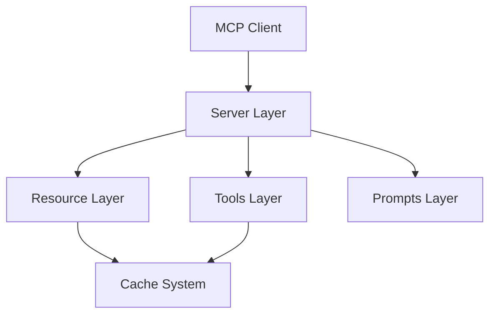

# UV Documentation MCP Server

An MCP server that provides programmatic access to [UV](https://docs.astral.sh/uv/) documentation through a standardized API. This server now leverages a modern, hierarchical resource structure that exposes both high‐level documentation sections and detailed command documentation (including subsections) as individual MCP resources. Tools have been streamlined, and many documentation queries are handled via the resource layer.

## Links

- [UV Documentation](https://docs.astral.sh/uv/)
- [MCP Python SDK](https://github.com/modelcontextprotocol/python-sdk)

## Quick Start

1. **Requirements:**  
   Ensure Python 3.13+ is installed (minimum 3.10 for MCP SDK compatibility).

2. **Clone the Repository:**  
   ```bash
   git clone https://github.com/StevenBtw/uv-docs-mcp.git
   cd uv-docs-mcp
   ```

3. **Set Up Virtual Environment and Install Dependencies:**  
   ```bash
   python3.13 -m venv env
   source env/bin/activate   # On Windows use: env\\Scripts\\activate
   pip install -e .
   ```

4. **Run the Server:**  
   ```bash
   uv run uv-docs
   ```  
   *(If using Claude Desktop or other MCP clients, adjust configuration accordingly.)*

## Architecture

The server is built with a modular and hierarchical design that clearly separates concerns:



- **Resource Layer:**  
  Exposes UV documentation via URIs with the scheme `uv-docs://`. Resources are structured hierarchically:
  - **Level 1:** Base sections (e.g., `uv-docs://cli`, `uv-docs://settings`, `uv-docs://resolver`)
  - **Level 2:** Individual commands (e.g., `uv-docs://cli/uv-run`, `uv-docs://cli/uv-cache`)
  - **Level 3:** Command subsections (e.g., `uv-docs://cli/uv-cache/uv-cache-dir`)

- **Tools Layer:**  
  Provides operational commands to interact with the cache and perform real-time searches.
  - **update_cache:** Updates the documentation cache if the live version differs.
  - **search_documentation:** Searches UV documentation using real-time query execution.

- **Prompts Layer:**  
  Supplies prompt templates for AI assistants to generate documentation summaries (e.g., the `summarize-docs` prompt).

## Components

### Resources

Resources are accessed using the `uv-docs://` URI scheme and provide the full hierarchy of documentation. For example:
- **Base Section:**  
  `uv-docs://cli` returns the list of all CLI commands.
  
- **Command Level:**  
  `uv-docs://cli/uv-cache` returns metadata about the `uv cache` command, including available documentation sections.
  
- **Subsection Level:**  
  `uv-docs://cli/uv-cache/uv-cache-dir` returns the detailed documentation content for the “uv cache dir” section.

Each resource returns JSON data with detailed metadata and, when requested, the full documentation content. This fine-grained breakdown allows MCP clients and AI assistants to query only the information they require.

### Tools

The available tools have been streamlined:
1. **update_cache**
   - **Purpose:** Update the documentation cache if the live version has changed.
   - **Input:**  
     ```json
     {
       "force": false
     }
     ```
2. **search_documentation**
   - **Purpose:** Perform real-time searches over the UV documentation.
   - **Input:**  
     ```json
     {
       "query": "search query"
     }
     ```

### Prompts

The server provides pre-built prompt templates for common documentation tasks:
- **summarize-docs:**  
  Creates a summary of UV documentation sections.  
  **Optional Arguments:**  
  ```json
  {
    "section": "cli|settings|resolver"
  }
  ```
  If no section is specified, summaries for all sections are generated.

## Installation & Configuration

### MCP Server Configuration

For **Claude Desktop** or other systems, modify the MCP server settings appropriately:

#### Development/Unpublished Configuration

```json
{
  "mcpServers": {
    "uv-docs": {
      "command": "uv",
      "args": [
        "--directory",
        "/Users/steven/Git/MCP/uv-docs",
        "run",
        "uv-docs"
      ]
    }
  }
}
```

#### Published Configuration

```json
{
  "mcpServers": {
    "uv-docs": {
      "command": "uvx",
      "args": [
        "uv-docs"
      ]
    }
  }
}
```

### Debugging & Inspection

For detailed debugging, use the [MCP Inspector](https://github.com/modelcontextprotocol/inspector):

```bash
npx @modelcontextprotocol/inspector uv --directory /Users/steven/Git/MCP/uv-docs run uv-docs
```

## Caching

The server implements a version-aware caching system to optimize documentation retrieval:
- **Initialization:** The cache is automatically initialized at startup.
- **Version Checking:** The live documentation version is checked against the cached version.
- **Segmented Caching:** Each documentation section (e.g., CLI, settings, resolver) is cached separately.
- **Manual Updates:** Use the `update_cache` tool when necessary.

## Development

### Project Structure

```plaintext
uv-docs/
├── src/
│   └── uv_docs/
│       ├── __init__.py
│       ├── server.py         # Server setup and routing
│       ├── resources.py      # Resource handling and MCP resource interface
│       ├── cache.py          # Version-aware cache system
│       ├── prompts.py        # Prompt templates for documentation tasks
│       └── tools.py          # Consolidated tool implementations (update_cache, search_documentation)
├── pyproject.toml            # Project configuration
└── README.md                # Project overview (this file)
```

### Building & Publishing

1. **Sync Dependencies & Lockfile:**  
   ```bash
   uv sync
   ```
2. **Build Package Distributions:**  
   ```bash
   uv build
   ```
3. **Publish to PyPI:**  
   ```bash
   uv publish
   ```

**Note:** Set PyPI credentials via:
- Token: `--token` or environment variable `UV_PUBLISH_TOKEN`
- Or username/password: `--username`/`UV_PUBLISH_USERNAME` and `--password`/`UV_PUBLISH_PASSWORD`

## Debugging

For the best debugging experience, use the [MCP Inspector](https://github.com/modelcontextprotocol/inspector):

```bash
npx @modelcontextprotocol/inspector uv --directory /Users/steven/Git/MCP/uv-docs run uv-docs
```

The Inspector will display a URL for browser-based debugging.

## Caching

The server implements a version-aware caching system:
- Cache initializes on server start
- Version checks against live documentation
- Automatic updates when version changes
- Manual updates via update_cache tool
- Each documentation section cached separately