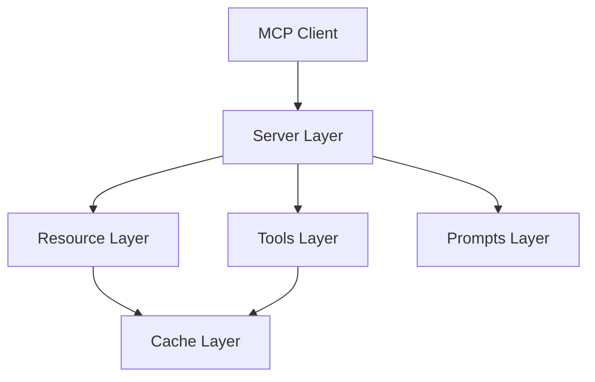

# UV Documentation MCP Server

An MCP server providing programmatic access to [UV](https://docs.astral.sh/uv/) documentation through a structured API. This server enables AI assistants to access accurate, up-to-date UV documentation in a standardized way.

## Links
- [UV Documentation](https://docs.astral.sh/uv/)
- [MCP Python SDK](https://github.com/modelcontextprotocol/python-sdk)

## Quick Start

1. Ensure Python 3.13+ is installed (minimum 3.10 for MCP SDK compatibility)
2. Clone this repository
3. Create a virtual environment and install dependencies:
   ```bash
   python3.13 -m venv env
   source env/bin/activate  # or env\Scripts\activate on Windows
   pip install -e .
   ```

## Architecture

The server follows a modular design with clear separation of concerns:



## Components

### Resources

The server provides documentation resources through a `uv-docs://` URI scheme:
- `uv-docs://cli` - CLI documentation and commands
- `uv-docs://settings` - Configuration settings
- `uv-docs://resolver` - Dependency resolver internals
- `uv-docs://versioning` - Version handling policies

Each resource returns JSON data with a consistent structure:
```json
{
  "type": "documentation_section",
  "section": "section_name",
  "elements": [
    {
      "name": "element_name",
      "description": "Element description"
    }
  ]
}
```

### Tools

1. **get_documentation**
   - Get full documentation for a specific UV documentation element
   ```json
   {
     "section": "cli|settings|resolver|versioning",
     "element": "element_name"
   }
   ```

2. **search_documentation**
   - Search UV documentation using real-time search
   ```json
   {
     "query": "search query"
   }
   ```

3. **update_cache**
   - Update documentation cache if version has changed
   ```json
   {}
   ```

### Prompts

The server provides prompt templates for documentation-related tasks:

1. **summarize-docs**
   - Creates a summary of UV documentation sections
   - Optional Arguments:
     ```json
     {
       "section": "cli|settings|resolver|versioning"
     }
     ```
   - If section is not specified, summarizes all sections
   - Returns a structured prompt for generating documentation summaries

## Installation

### Claude Desktop

#### Configuration Location
- MacOS: `~/Library/Application\ Support/Claude/claude_desktop_config.json`
- Windows: `%APPDATA%/Claude/claude_desktop_config.json`

<details>
  <summary>Development/Unpublished Servers Configuration</summary>
  ```json
  "mcpServers": {
    "uv-docs": {
      "command": "uv",
      "args": [
        "--directory",
        "/Users/steven/Git/MCP/uv-docs",
        "run",
        "uv-docs"
      ]
    }
  }
  ```
</details>

<details>
  <summary>Published Servers Configuration</summary>
  ```json
  "mcpServers": {
    "uv-docs": {
      "command": "uvx",
      "args": [
        "uv-docs"
      ]
    }
  }
  ```
</details>

## Development

### Project Structure
```plaintext
uv-docs/
├── src/
│   └── uv_docs/
│       ├── __init__.py
│       ├── server.py    # Server setup and routing
│       ├── resources.py # Resource handling
│       ├── cache.py     # Cache system
│       └── tools/       # Tool implementations
│           ├── __init__.py
│           ├── cache.py
│           ├── docs.py
│           └── search.py
├── pyproject.toml     # Project configuration
└── README.md         # Project overview
```

### Building and Publishing

1. Sync dependencies and update lockfile:
```bash
uv sync
```

2. Build package distributions:
```bash
uv build
```

3. Publish to PyPI:
```bash
uv publish
```

Note: Set PyPI credentials via:
- Token: `--token` or `UV_PUBLISH_TOKEN`
- Or username/password: `--username`/`UV_PUBLISH_USERNAME` and `--password`/`UV_PUBLISH_PASSWORD`

### Debugging

For the best debugging experience, use the [MCP Inspector](https://github.com/modelcontextprotocol/inspector):

```bash
npx @modelcontextprotocol/inspector uv --directory /Users/steven/Git/MCP/uv-docs run uv-docs
```

The Inspector will display a URL for browser-based debugging.

## Caching

The server implements a version-aware caching system:
- Cache initializes on server start
- Version checks against live documentation
- Automatic updates when version changes
- Manual updates via update_cache tool
- Each documentation section cached separately